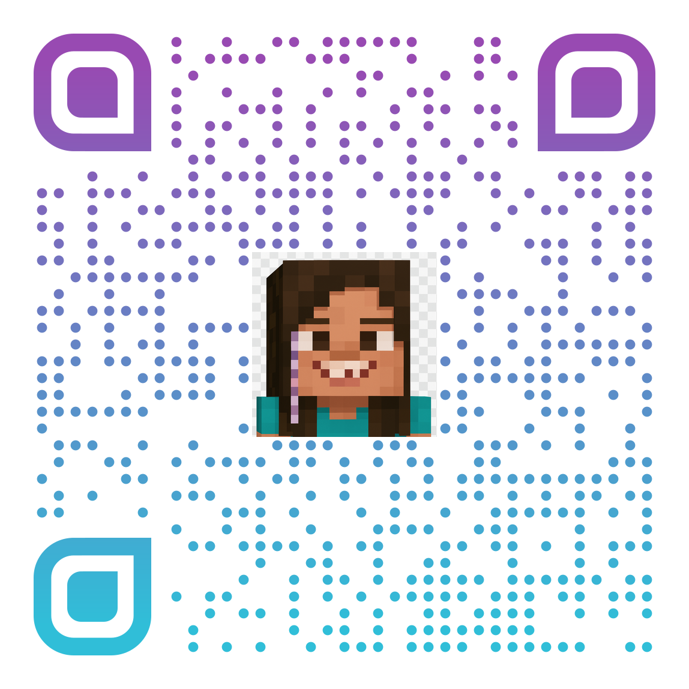

# Birthday Minecraft Light Game

The game can be played by visiting https://game.amelie.belgar.eu/bd-25/, or by scanning this QR code.

This repository contains a simple top-down game, inspired by Minecraft, being developed for Amelie's 7th birthday.

## Project Details

- **Goal:** Create a fun, exploration-based game playable in a web browser. It should represent some of the core elements of Minecraft, while being much simpler and allowing to "draw" pictures with the colored blocks.
- **Style:** Top-down perspective with tile-based maps and sprite characters, inspired by classic exploration games.

## Documentation

Detailed planning documents can be found in the `/docs` directory.

## Core Development Steps

### 1. Use VSCode, Copilot with GPT-4.1, GPT-5 and Sonnet 4.5 to drive the game development

Exploring vibe coding capabilities of these models was one of the goals of this project. It has worked quite well at times and not at all at others. In general:

- The more the AI iterated over the xisting code base, the messier it got.
- At times it was challenging to catch up on the AI created code, because it's just too easy to not review the AI made changes detailed enough.

### 2. Use Copilot to create a game icon

Copilot was very successful in creating a Minecraft-like picture based on one of Amelie's photos.

### 3. Create a Minecraft styled title

Use https://www.textstudio.com/logo/minecraft-3d-text-41

### 3. Turning it into a PWA

Using the either of the following two, free online apps to generate icons from a source image and manifest metadata, to turn the web app into a PWA.

- https://pwa-icon-generator.vercel.app/
- https://realfavicongenerator.net/

### 4. Creating a QR Code

Generate a QR code, using https://www.qrcode-monkey.com, to easily access the URL of the deployed game.

### 5. Create a printable birthday card

Using https://canva.com to design the card and include the game icon

